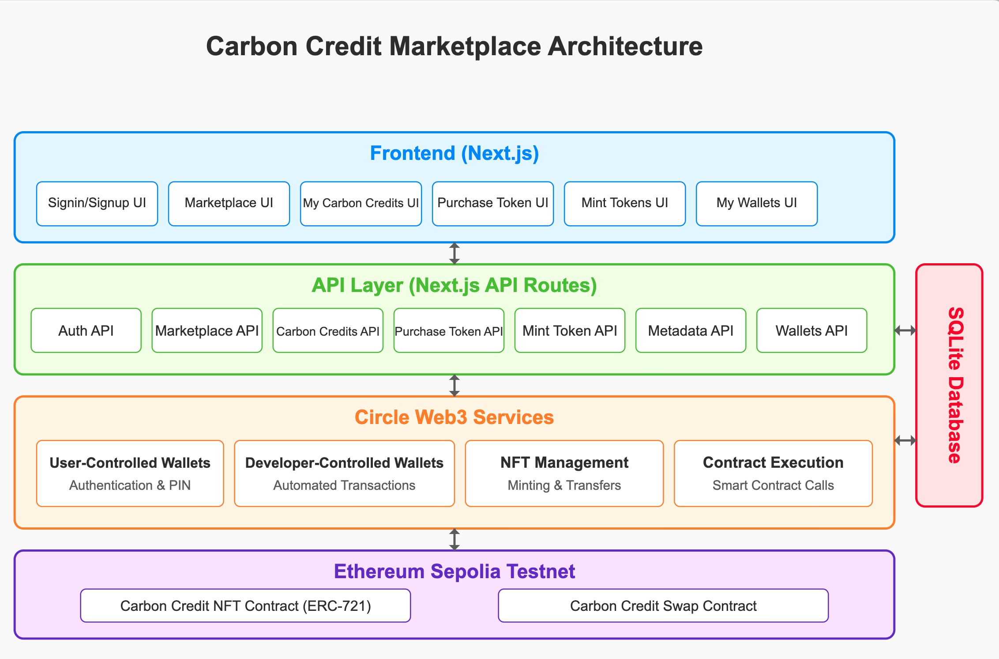

# Carbon Credit Marketplace

A decentralized marketplace for verified carbon credits built on Ethereum using Circle's Web3 Services. This application demonstrates how Circle's platform can be used to create a transparent, efficient marketplace for environmental assets.

## Overview

The Carbon Credit Marketplace allows:

- **Administrators** to mint carbon credit NFTs and approve them for sale
- **Users** to browse and purchase verified carbon credits using USDC
- **Seamless transactions** via Circle's programmable wallets, smart contract
  interactions, digital asset transactions, and authentication.

## Architecture



The application consists of several key components:

1. **Frontend**: Next.js React application for user interface
2. **Backend API Layer**: Next.js API routes for server-side logic
3. **Circle Web3 Services**: For wallet management and blockchain interactions
4. **Smart Contracts**:
   - Carbon Credit NFT Contract (ERC-721)
   - Carbon Credit Swap Contract (for executing purchases)
5. **Database**: Stores metadata for carbon credits

## Prerequisites

To run this application locally, you'll need:

- Node.js (v16+)
- npm or yarn
- Circle Developer Account with API keys
- Ethereum wallet (Circle's Programmable Wallets recommended for testing)
- Sepolia Testnet ETH for gas fees

## Environment Setup

Create a `.env.local` file in the root directory with the following variables:

```
# Authentication
NEXTAUTH_SECRET=                        # Generate a random secret (openssl rand -base64 32)
NEXTAUTH_URL=http://localhost:3000

# Circle API Configuration
CIRCLE_BASE_URL=https://api.circle.com/v1/
CIRCLE_API_KEY=                         # From Circle Developer Console
CIRCLE_ENTITY_CIPHERTEXT=               # From Circle entity setup

# Contract Addresses
CARBON_CREDIT_CIRCLE_CONTRACT_ADDRESS=  # Your deployed NFT contract address
CARBON_CREDIT_SWAP_CONTRACT_ADDRESS=0xCfFf431f3A0481E451f6F71F9dbffa9d44a1B6c2

# RPC Configuration
RPC_URL_SEPOLIA=https://eth-sepolia.g.alchemy.com/v2/
ALCHEMY_API_KEY=                        # From Alchemy dashboard
```

## Installation

1. Clone the repository:

   ```
   git clone https://github.com/ja9-look/carbon-credit-marketplace.git
   cd carbon-credit-marketplace
   ```

2. Install dependencies:

   ```
   npm install
   # or
   yarn install
   ```

3. Run the development server:

   ```
   npm run dev
   # or
   yarn dev
   ```

4. Open [http://localhost:3000](http://localhost:3000) in your browser.

## Database Setup

This application requires a database for storing user information and carbon credit metadata. You'll need to:

1. Set up your database:

   The project uses Prisma with SQLite as the database.
   Initialize the database schema:

   ```
   npx prisma db push
   # or
   yarn prisma db push
   ```

2. Create test users:

   <b>Admin user:</b> You'll need to manually create an admin account with email admin@carboncredit.com

   <b>Regular users:</b> Create test buyer accounts as needed (e.g. buyer@carboncredit.com)

## Getting Started

### Prerequisites

Before running the project, you'll need to:

1. Deploy an NFT Contract Template using Circle:

- Follow the [Deploy Smart Contract Template guide](https://developers.circle.com/w3s/deploy-smart-contract-template#2-mint-an-nft)
- Deploy an ERC-721 NFT contract template on Sepolia testnet
- Use the deployed contract address as your `CARBON_CREDIT_CIRCLE_CONTRACT_ADDRESS` in the environment variables

2. Mint Initial NFTs:

- Use Circle's Developer Console to mint NFTs on your deployed contract (set token owner as admin@carboncredit.com ETH-SEPOLIA wallet address)
- These NFTs will be used by your application for the approval and purchase workflow

## Key Features

### Admin Features

- **👷‍♀️ NFT Minting**: Create new carbon credit NFTs with metadata
- **☑️ NFT Approval**: Approve NFTs for sale on the marketplace (Work In Progress)

### User Features

- **👀 Browse Marketplace**: View all available carbon credits for purchase
- **💵 Purchase Credits**: Buy carbon credits using USDC (Work In Progress)
- **🔐 PIN Authentication**: Secure transactions with Circle's PIN system
- **⏳ Transaction History**: View past purchases

## Circle Integration Highlights

This project leverages several key Circle Web3 Services:

1. **[User-Controlled Wallets](https://developers.circle.com/interactive-quickstarts/user-controlled-wallets)**: For user-managed wallets requiring PIN authentication
2. **[Developer-Controlled Wallets](https://developers.circle.com/interactive-quickstarts/dev-controlled-wallets)**: For application-managed wallets enabling automated transactions
3. **[NFT Management](https://developers.circle.com/w3s/deploy-smart-contract-template#1-deploy-the-smart-contract)**: For minting and transferring carbon credit NFTs
4. **Contract Execution**: For interacting with smart contracts
5. **PIN Authentication**: For secure transaction authorization

## Smart Contract Architecture

The project uses two main contracts:

1. **Carbon Credit NFT Contract**: An ERC-721 contract for representing carbon credits

   - Minting new credits
   - Managing metadata
   - Transfer functionality

2. **Carbon Credit Swap Contract**: Handles the exchange of carbon credits for USDC
   - Verifies approval status
   - Executes transfers
   - Manages payments

## API Routes

This application uses Next.js API routes to handle server-side operations. Key API namespaces include:

- `/api/auth/_` : Authentication endpoints (powered by NextAuth.js)
- `/api/carbon-credits/_` : Carbon credit management endpoints
- `/api/marketplace/_` : Marketplace management endpoints
- `/api/metadata/_` : NFT Metadata management endpoints
- `/api/user/_` : User management endpoints
- `/api/wallets/_` : Wallet management endpoints

For a complete list of available endpoints, please refer to the `/app/api` directory in the source code.

## Development Workflow

### Typical Admin Flow

1. Admin creates a new carbon credit NFT
2. Admin approves the NFT for sale on the marketplace
3. The NFT becomes available for purchase

### Typical User Flow

1. User browses available carbon credits
2. User selects a credit to purchase
3. User confirms purchase and completes PIN challenge
4. User receives the carbon credit NFT

## Troubleshooting

Common issues and their solutions:

- **"Cannot find target wallet"**: Ensure your Circle API key has the correct permissions
- **"NFT not approved for transfer"**: Admin must approve the NFT before it can be purchased
- **PIN challenge doesn't appear**: Check user token validity and ensure proper Circle SDK initialization

## ⚠️ Implementation Status

### Work-in-Progress Features

#### NFT Minting Flow

- Current Implementation: NFTs must be created through the Circle Developer Console. The application supports browsing these pre-minted NFTs.
- Future Enhancement: Direct in-app minting of NFTs is planned, which will allow admins to create new carbon credits directly through the user interface without requiring the Circle Developer Console.

#### NFT Approval & Purchase Flow

The NFT approval and purchase flow is currently a work-in-progress. While the code structure and API endpoints have been created, there may be issues with:

- NFT approval transaction completion
- Purchase transaction execution

For this reason, please note that some functionalities in relation to these specific flows may not work end-to-end in the current version.

### Next Steps for Implementation

To complete these features, the following work is planned:

- Implementing direct NFT minting within the application
- Finalizing the smart contract interaction for NFT approvals
- Improving error handling for failed transactions
- Adding transaction status tracking and notifications
- Comprehensive testing of the entire flow

## Future Enhancements

Potential improvements for the project:

1. Multi-chain support leveraging Circle's CCTP
2. Batch minting and approvals for admins
3. Secondary market for carbon credit trading
4. Enhanced analytics and impact tracking
5. Integration with real-world carbon credit verification systems

## Contributing

Contributions are welcome! Please feel free to submit a Pull Request.

## License

This project is licensed under the MIT License - see the LICENSE file for details.

## Acknowledgements

- Circle for providing the Web3 Services platform
- The carbon credit community for inspiration and use case validation
